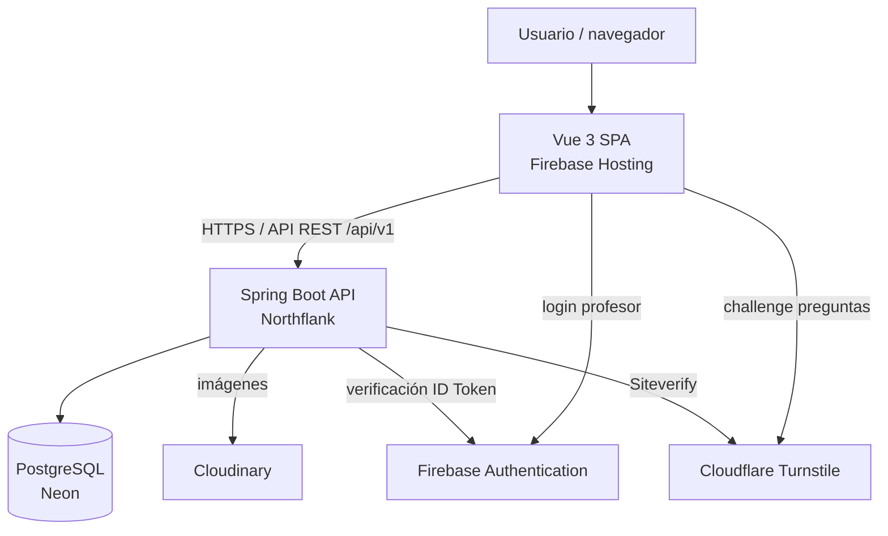

<p align="center">
  
</p>

# Hidrología UdeA

Aplicación web académica para apoyar la enseñanza y consulta de contenidos de la materia de Hidrología. Centraliza publicaciones, preguntas de estudiantes, enlaces de interés, recursos multimedia y métricas de uso en una plataforma full-stack desplegada en producción.

Hidrología UdeA es un proyecto académico relacionado con la Universidad de Antioquia, pero no constituye un portal institucional oficial de la Universidad.

<p align="center">
  <a href="https://github.com/camiloGoca/hidrologia-udea/actions/workflows/ci.yml"></a>
  <a href="https://github.com/camiloGoca/hidrologia-udea/releases/tag/v1.0.0"></a>
  
  
</p>

## Enlaces rápidos

| Recurso | Enlace |
| --- | --- |
| Aplicación | [https://hidrologia-udea.web.app](https://hidrologia-udea.web.app) |
| Release estable | [v1.0.0](https://github.com/camiloGoca/hidrologia-udea/releases/tag/v1.0.0) |
| Especificación del producto | [docs/PRODUCT_SPEC.md](docs/PRODUCT_SPEC.md) |
| Arquitectura técnica | [docs/ARCHITECTURE.md](docs/ARCHITECTURE.md) |

## Acerca del proyecto

El proyecto atiende una necesidad académica concreta: organizar material de Hidrología, facilitar la consulta por talleres y parciales, permitir que los estudiantes envíen preguntas, y dar al profesor un flujo privado para revisar, editar y publicar contenido.

Perfiles principales:

| Perfil | Acceso | Capacidades |
| --- | --- | --- |
| Estudiante | Público, sin cuenta | Consulta publicaciones, busca contenido, revisa enlaces de interés y envía preguntas con nickname opcional. |
| Profesor / administrador | Privado | Revisa preguntas, administra publicaciones, hashtags, enlaces, imágenes y estadísticas. |

## Funcionalidades principales

| Área | Funcionalidades |
| --- | --- |
| Contenido público | Página principal, talleres, parciales, publicaciones, hashtags, búsqueda y enlaces de interés. |
| Preguntas | Envío público sin cuenta, nickname opcional, imagen opcional JPEG/PNG, protección anti-abuso con Cloudflare Turnstile y revisión administrativa. |
| Administración | Login privado, gestión de preguntas, publicaciones, hashtags, enlaces de interés y estadísticas. |
| Editor académico | Documento estructurado, H2/H3, listas, citas, enlaces, estilos controlados, bloques académicos, imágenes, videos, vista previa y autosave para borradores/archivadas. |
| Multimedia | Imágenes en Cloudinary, videos de YouTube, YouTube Live, Shorts, embeds, TikTok en formatos completos soportados y video directo HTTPS `.mp4`/`.webm`. |
| Analytics | Visitas, consultas de secciones y publicaciones, panel privado de estadísticas y enfoque de privacidad. |

## Documentación del proyecto

El repositorio separa documentación funcional y técnica para facilitar revisión, mantenimiento y evolución.

| Documento | Contenido |
| --- | --- |
| [Especificación del producto](docs/PRODUCT_SPEC.md) | Visión, usuarios, funcionalidades, reglas de negocio y alcance. |
| [Arquitectura](docs/ARCHITECTURE.md) | Arquitectura, API, datos, seguridad, integraciones, CI/CD, testing y decisiones técnicas. |

## Aspectos técnicos destacados

El sistema implementa:

- aplicación web full-stack desplegada;
- SPA Vue 3 + TypeScript;
- API REST con Spring Boot 4.1.x;
- PostgreSQL con esquema gestionado por Flyway;
- autenticación del profesor con Firebase;
- autorización administrativa final en backend mediante UID;
- editor académico con documento estructurado y renderer seguro;
- almacenamiento de imágenes en Cloudinary;
- protección anti-abuso con Cloudflare Turnstile;
- analytics propios orientados a privacidad;
- testing automatizado backend/frontend;
- CI/CD con GitHub Actions;
- previews read-only para Pull Requests internos;
- despliegue de producción a Firebase Hosting y Northflank.

## Arquitectura

La aplicación usa una arquitectura monolítica modular: una SPA estática consume una API REST versionada; el backend concentra reglas de negocio, seguridad, persistencia e integraciones externas.



Para decisiones técnicas, seguridad, API y detalles de infraestructura, consulta [docs/ARCHITECTURE.md](docs/ARCHITECTURE.md).

## Stack tecnológico

| Categoría | Tecnologías |
| --- | --- |
| Frontend | Vue 3, TypeScript, Vite, Vue Router, Pinia, Axios, Tailwind CSS, Tiptap / ProseMirror. |
| Backend | Java 17, Spring Boot 4.1.0, Maven, Spring Web MVC, Spring Security, Spring Data JPA, Bean Validation. |
| Datos | PostgreSQL, Neon PostgreSQL, Flyway, Hibernate con `ddl-auto=validate`. |
| Autenticación y seguridad | Firebase Authentication, Firebase Admin SDK, CORS explícito, Cloudflare Turnstile, API stateless. |
| Multimedia | Cloudinary, imágenes JPEG/PNG, embeds seguros de video. |
| Infraestructura | Firebase Hosting, Northflank, Docker, Docker Compose local. |
| CI/CD | GitHub Actions, Firebase Hosting Preview Channels, despliegue live frontend, build/deploy backend en Northflank. |
| Testing | Vitest, Vue Test Utils, JUnit, Mockito, Spring MVC tests, pruebas JPA con H2. |

## Estructura del repositorio

```text
hidrologia-udea/
├── frontend/   # SPA Vue 3
├── backend/    # API REST Spring Boot
├── docs/       # especificación funcional y arquitectura técnica
└── infra/      # infraestructura local
```

## Requisitos para desarrollo

- Git.
- Node.js compatible con `frontend/package.json` (`^22.18.0 || >=24.12.0`) y npm.
- Java 17.
- Maven.
- Docker.
- Docker Compose.

## Configuración local

1. Copia `.env.example` como `.env`.
2. Ajusta los valores locales necesarios.
3. No guardes secretos reales en archivos versionados.

`.env` contiene configuración local y está ignorado por Git. `.env.example` mantiene placeholders y valores de ejemplo seguros.

Si el puerto `5432` está ocupado, cambia `POSTGRES_HOST_PORT` y usa el mismo puerto dentro de `DB_URL`:

```text
POSTGRES_HOST_PORT=<PUERTO_LIBRE>
DB_URL=jdbc:postgresql://127.0.0.1:<PUERTO_LIBRE>/hidrologia_udea
```

## Ejecución local

### PostgreSQL

Desde la raíz del repositorio:

```powershell
docker compose --env-file .env -f infra/docker-compose.yml up -d
docker compose --env-file .env -f infra/docker-compose.yml ps
```

El servicio debe aparecer como `healthy`.

Para detenerlo sin borrar datos:

```powershell
docker compose --env-file .env -f infra/docker-compose.yml stop
```

Para eliminar contenedor y red sin borrar el volumen:

```powershell
docker compose --env-file .env -f infra/docker-compose.yml down
```

Evita `docker compose down -v` salvo que quieras borrar la base local.

### Backend

Docker Compose lee `.env` cuando se pasa con `--env-file`, pero Maven/Spring Boot no leen automáticamente ese archivo. Carga las variables en PowerShell antes de iniciar el backend:

```powershell
Get-Content ..\.env | Where-Object { $_ -and -not $_.TrimStart().StartsWith('#') } | ForEach-Object {
    $name, $value = $_.Split('=', 2)
    Set-Item -Path "Env:$name" -Value $value
}
$env:SPRING_PROFILES_ACTIVE='local'
```

Luego:

```powershell
cd backend
mvn spring-boot:run
```

URLs locales útiles:

- API técnica: `http://localhost:8080/api/v1/health`
- Actuator: `http://localhost:8080/actuator/health`
- Swagger UI: `http://localhost:8080/swagger-ui/index.html`

### Frontend

```powershell
cd frontend
npm install
npm run dev
```

Vite sirve la aplicación normalmente en `http://localhost:5173`. En desarrollo, el proxy de Vite envía `/api` hacia Spring Boot en `http://localhost:8080`.

## Backend en Docker

El backend incluye un `Dockerfile` multi-stage en `backend/`:

- etapa builder con Maven y Java 17;
- etapa runtime con JRE Java 17;
- ejecución del JAR como usuario no-root;
- puerto configurable mediante `PORT`;
- perfil `prod` con DataSource, JPA y Flyway activos;
- configuración de base de datos por variables de entorno;
- Hibernate en `ddl-auto=validate`.

Para construir la imagen localmente:

```powershell
cd backend
docker build -t hidrologia-backend:local .
```

## Validaciones

Backend:

```powershell
cd backend
mvn test
mvn package
```

Frontend:

```powershell
cd frontend
npm run test:unit
npm run type-check
npm run lint:check
npm run build
```

`npm run lint:check` valida sin modificar archivos. `npm run lint` existe para desarrollo y puede aplicar fixes automáticamente.

## Seguridad

- `.env` está ignorado por Git.
- `.env.example` solo contiene placeholders y valores de ejemplo.
- El JSON de service account de Firebase debe vivir fuera del repositorio.
- Los Firebase ID Tokens no se persisten manualmente en el frontend.
- La autorización administrativa no depende del email: el backend compara el UID del token con `FIREBASE_ADMIN_UID`.
- CORS usa origins explícitos para producción y un patrón restringido para los Preview Channels de Firebase; no se utiliza un wildcard global `*`.
- Los secretos de Cloudinary solo pertenecen al backend.
- Turnstile usa site key pública en frontend y secret key solo en backend.
- En producción, Turnstile puede validar `action` y `hostname`.
- Los previews de Pull Request son read-only y bloquean escrituras administrativas, preguntas y analytics.
- Analytics no almacena IP, ubicación, fingerprint, correo, UID de Firebase, user agent ni referrer.

El detalle de seguridad está en [docs/ARCHITECTURE.md](docs/ARCHITECTURE.md).

## Producción y CI/CD

| Componente | Servicio |
| --- | --- |
| Frontend | Firebase Hosting |
| Backend | Northflank |
| Base de datos | Neon PostgreSQL |
| Imágenes | Cloudinary |
| CI/CD | GitHub Actions |

GitHub Actions ejecuta CI de backend y frontend en Pull Requests y pushes a `main`.

En Pull Requests internos:

- ejecuta validaciones backend/frontend;
- publica un Firebase Hosting Preview Channel temporal;
- usa `VITE_PREVIEW_READ_ONLY=true`;
- apunta al backend real de producción solo para lecturas públicas;
- no despliega backend de preview;
- no habilita admin, envío de preguntas, Turnstile ni escrituras de analytics.

En push/merge a `main`:

- ejecuta CI;
- despliega el frontend live en Firebase Hosting;
- dispara y verifica el build/deploy del backend en Northflank para el `github.sha` exacto.

## Versiones y releases

Las versiones estables se identifican mediante Git tags y GitHub Releases.

Primera versión estable:

- [v1.0.0](https://github.com/camiloGoca/hidrologia-udea/releases/tag/v1.0.0)

`v1.0.0` representa la versión de producción validada en ese momento. La rama `main` puede continuar evolucionando después del tag, por lo que este README puede incluir documentación posterior a esa versión.

## Estado del proyecto

La versión `v1.0.0` fue desplegada y validada en producción. El repositorio puede seguir evolucionando con ajustes, correcciones o nuevas etapas, manteniendo la documentación funcional y técnica como referencia.

La aplicación de producción está disponible en [https://hidrologia-udea.web.app](https://hidrologia-udea.web.app).

## Nota académica

Hidrología UdeA es un proyecto académico para apoyar la enseñanza y consulta de contenidos de Hidrología. No constituye un portal institucional oficial de la Universidad de Antioquia.
